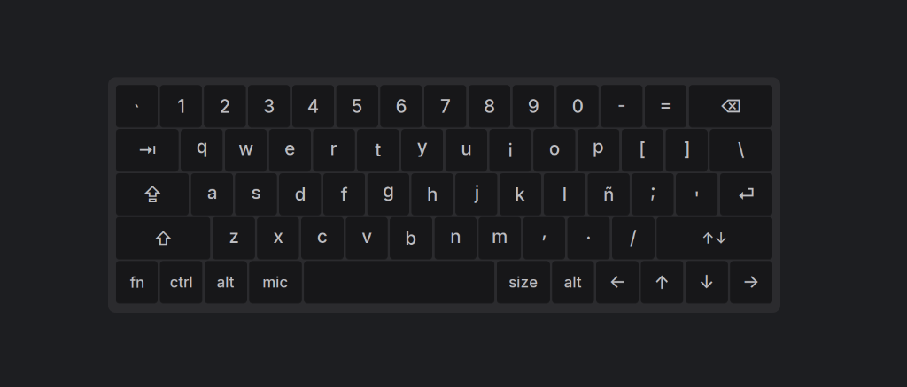
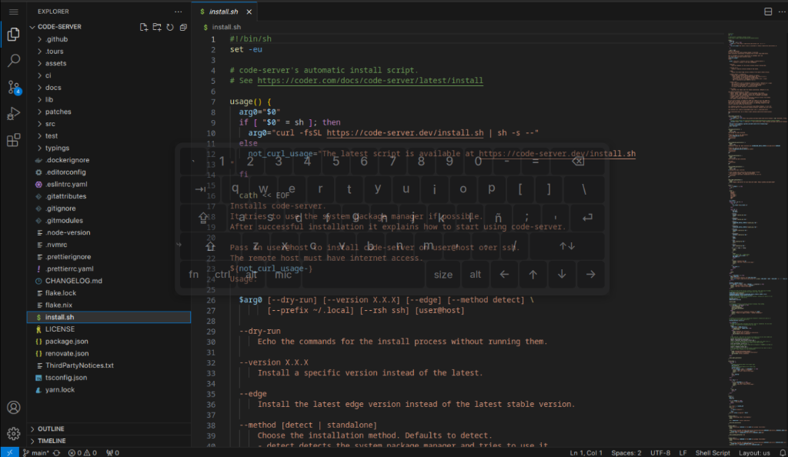

# 0-Board




A virtual keyboard for Linux tablets, written in C99. ~10MB RAM, 67KB binary, zero dependencies beyond Cairo+X11.

Designed for the HP x2 210 G1 (Atom Z8300, 2-4GB RAM) but runs on any X11 Linux system.

---

## Quick Usage

### Basics

| Key | Action |
|-----|--------|
| Tap a letter/number | Types it |
| **Shift** (`⇧`) | First tap = one-shot (next letter is uppercase, then reverts). Second tap = locked (all caps until tapped again). Third tap = off. |
| **Caps Lock** (`⇪`) | Toggle caps lock |
| **Ctrl**, **alt** | Same as Shift: one-shot → locked → off |
| **↑↓** | Move keyboard to top or bottom of screen |

### FN Layer (development keys)

**`fn`** activates a function-key row. First tap = one-shot, second = locked, third = off.

When FN is active, the top number row changes to:

```
esc  F1  F2  F3  F4  F5  F6  F7  F8  F9  F10  F11  F12
```

Tap any FN key — it's sent and FN auto-deactivates (one-shot).  
Double-tap `fn` to lock FN on. Tap `fn` again to turn it off.

### Menu & Controls

**`fn` + `size`** opens the menu bar with:

| Control | Action |
|---------|--------|
| **− / +** | Decrease / increase keyboard opacity |
| **Palette icon** | Cycle through color themes (Space Gray, Silver) |
| **Red close button** | Exit 0-Board |

The menu bar also shows the app branding. Tap outside the menu or press `fn` + `size` again to close it.

### Resize & Position

| Key | Action |
|-----|--------|
| **size** | Cycle keyboard size: Small → Medium → Large |
| **Drag edge** | Touch and drag any edge of the keyboard to reposition |
| **↑↓** | Snap keyboard to top or bottom of screen |

### Voice Dictation

| Key | Action |
|-----|--------|
| **mic** | Start/stop voice recording (requires external script at `/usr/local/bin/0-voice`) |

### Modifier States (visual feedback)

- **One-shot**: Tap Shift/Ctrl/Alt — the next non-modifier key gets the modifier applied. Key border turns accent blue.
- **Locked**: Double-tap a modifier — it stays active. Key fills orange.
- Tap again to unlock.

---

## Quick Reference (Key Labels)

```
Row 1:  ` ~  1 !  2 @  3 #  4 $  5 %  6 ^  7 &  8 *  9 (  0 )  - _  = +  ⌫
        esc  F1  F2  F3  F4  F5  F6  F7  F8  F9  F10  F11  F12     (FN active)

Row 2:  ⇥  q  w  e  r  t  y  u  i  o  p  [ {  ] }  \ |

Row 3:  ⇪  a  s  d  f  g  h  j  k  l  ñ  ; :  ' "  ⏎

Row 4:  ⇧  z  x  c  v  b  n  m  , <  . >  / ?  ↑↓

Row 5:  fn  ctrl  alt  mic  [space]  size  alt  ←  ↑  ↓  →
```

---

## Install

### From source

```bash
# Dependencies (Debian/Ubuntu)
sudo apt install libcairo2-dev libx11-dev libxtst-dev libfontconfig1-dev pkg-config make gcc

# Build
make

# Run
./0-board
```

### Install to ~/.local

```bash
make install
# Binary: ~/.local/bin/0-board
# Fonts:  ~/.local/share/0-board/fonts/
```

### On Atom/Cherry Trail CPUs (Z8300 and similar)

Build with conservative instruction set:

```bash
make CC=gcc CFLAGS="-Wall -Wextra -O2 -march=x86-64 -mtune=atom -flto -I./src $(pkg-config --cflags cairo fontconfig freetype2)" LIBS="-lX11 -lXtst -lcairo -lfontconfig -lfreetype -lm"
```

---

## Layout

All developer symbols are accessible:

| Key | Shift gives | Used for |
|-----|-------------|----------|
| `` ` `` | `~` | Backtick for shell commands, tilde |
| `[` | `{` | Curly braces (code blocks) |
| `]` | `}` | Closing curly brace |
| `\` | `\|` | Pipe operator |
| `1`-`0` | `!@#$%^&*()` | All shifted symbols |
| `-` | `_` | Underscore |
| `=` | `+` | Plus |
| `;` | `:` | Colon |
| `'` | `"` | Double quote |
| `,` | `<` | Less than |
| `.` | `>` | Greater than |
| `/` | `?` | Question mark |
| `ñ` | `Ñ` | Spanish ñ |

FN layer adds: **Escape**, **F1** through **F12**.

---

## Performance

| Metric | 0-Board | Notes |
|--------|---------|-------|
| **Idle CPU** | < 0.1% | Event-driven, blocks on X11 |
| **Memory (RSS)** | ~10MB | Dual-pass render + surface cache |
| **Binary size** | 67KB | Stripped, LTO, no C++ runtime |
| **Startup** | < 0.1s | Lazy font loading |
| **Dependencies** | Cairo, X11, Xtst, FontConfig | No Qt/GTK/Electron |

---

## Project Structure

```
0-Board/
├── src/
│   ├── main.c              # Entry point
│   ├── layout.c            # Keyboard layout definition (Apple Magic layout)
│   ├── layout_engine.c     # Geometry calculation for key positions
│   ├── keyboard.c          # Keyboard state machine
│   ├── keyboard_state.c    # Modifier one-shot/locked logic
│   ├── keysym_util.c       # Shared keysym mapping (shift pairs)
│   ├── engine.c            # XTest key injection
│   ├── key_injector.c      # Key injection helper (modifier detection)
│   ├── x11_window.c        # X11 window management
│   ├── x11_events.c        # X11 event loop and error recovery
│   ├── x11_cairo_bridge.c  # Double-buffered Cairo+X11 rendering
│   ├── cairo_renderer.c    # Cairo drawing primitives
│   ├── renderer.c          # Abstract renderer interface
│   ├── font_manager.c      # Font discovery via FontConfig
│   ├── colors.c            # Color schemes
│   ├── config.c            # Config file parser (X Macro table)
│   ├── ui.c                # UI main loop and orchestration
│   ├── ui_events.c         # Touch/click event handling
│   ├── ui_drag.c           # Window drag support
│   ├── ui_render_helper.c  # Keyboard rendering (static + dynamic passes)
│   ├── debug.c             # Debug logging
├── assets/
│   ├── fonts/              # Inter Light + Regular (800KB)
│   ├── themes/             # Theme files
│   └── images/             # Screenshots
├── tests/
│   ├── test_common.h       # Test harness
│   ├── test_keyboard_state.c  # 27 state machine tests
│   ├── test_layout_keys.c     # 63 layout integrity tests
│   ├── test_engine_keysym.c   # 16 keysym mapping tests
│   └── test_engine_integration.c # 7 engine contract tests
├── docs/superpowers/       # Spec and plan documents
└── Makefile
```

---

## Tests

```bash
make test
```

113 tests covering: keyboard state machine (shift, caps, ctrl, alt, fn), layout integrity (all keys present, init idempotent), keysym resolution (shift pairs, letter detection), and engine contract (null guards, XTest required).

---

## TDE/Trinity Integration

For HP x2 210 G1 and similar detachables running TDE:

- **Login screen**: 0-Board launches via TDM Xsetup (`/etc/trinity/tdm/Xsetup`)
- **User session**: Autostart via `~/.trinity/Autostart/0-board.desktop`
- **Lock screen**: `kdesktop_lock` wrapper launches 0-Board. Window rule (`keepabove`) keeps it above the lock dialog. Touch input bypasses the keyboard grab (XGrabKeyboard only, no pointer grab).
- **Monitor daemon**: `lock-monitor.sh` ensures 0-Board is running during lock/unlock transitions.

---

## License

MIT — see LICENSE file.

Developed by **Leonardo Vergara** <leonardovergaramarin@gmail.com>
